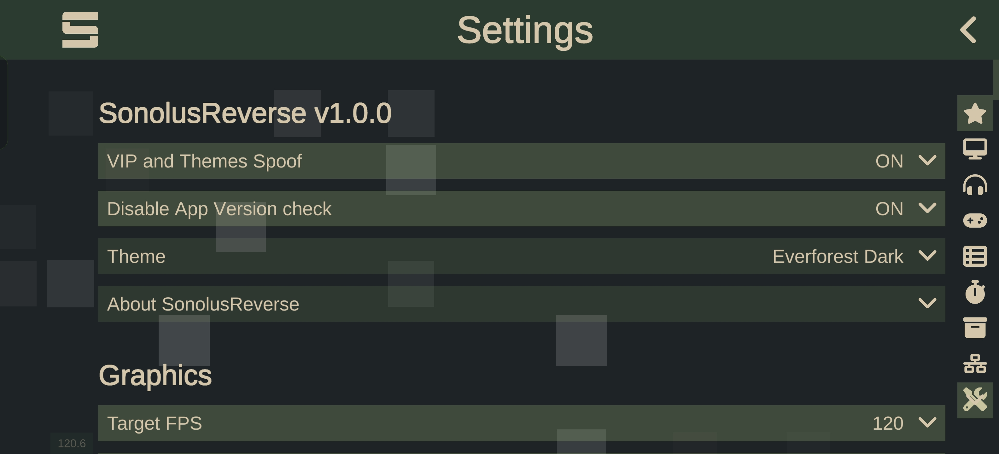
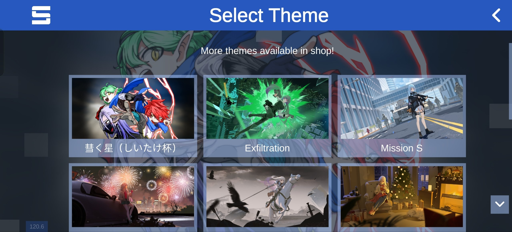

> [!WARNING]  
> This Project is for **educational and research purposes only**. **Not affiliated with Sonolus**; using this mod may violate Sonolus' [TOS](https://sonolus.com/tos) and [EULA](https://sonolus.com/eula).  
> **Use at your own risk.** I'm **NOT** responsible for bans or anything else that happens to you or your account.  
> If you enjoy Sonolus, please consider supporting project by purchasing VIP or gems in-game.  
> If you wanna contact me: see [Contact Me](#contact-me)

# SonolusReverse

Mod for the [Sonolus](https://sonolus.com/) rhythm game with extra features, written using [Frida](https://frida.re/) and [frida-il2cpp-bridge](https://github.com/vfsfitvnm/frida-il2cpp-bridge)

Tested Sonolus version `1.1.1` on Android. Should work on iOS too, but **untested**.

## Screenshots




> `Rosé Pine 2` - A custom theme  
> `彗く星（しいたけ杯）` - An exclusive theme for tournament participants

## Features

- **Custom Settings Section**
- **VIP + Themes spoof**: Client-side unlock of VIP _(removes ad)_ and all themes _(including exclusives)_
- **Version Spoof**: Override the version used by client compatibility checks
    > WIP: **Custom Themes**: Create your own themes! Currently only hardcoded.

##### Planned:

See our [TODO](TODO.md). If you wanna contribute: see [Contributing](#contributing)

## Building

0. Download Sonolus executable and install npm dependencies.

```bash
npm install
```

1. Build a script

```bash
npm run build
```

Script will be built into `dist/agent.js`

2. Patch Sonolus executable using Frida Gadget in **script** mode.  
   I'm using [fgi](https://github.com/commonuserlol/fgi) to patch (APK only).

```bash
fgi -i <sonolus-apk> -t script -l dist/agent.js
```

## Developing

0. Download Sonolus executable and install npm dependencies.

```bash
python -m venv .venv # Creating a virtual environment for Python

# Activate Python venv, it's depending on what OS you are. For example Linux with fish:
. .venv/bin/activate.fish

pip install -r requirements.txt

npm install
```

1. Patch Sonolus executable using Frida Gadget in **listen** mode _(or use frida-server)_.  
   I'm using [fgi](https://github.com/commonuserlol/fgi) to patch (APK only).

```bash
fgi -i <sonolus-apk>
```

2. Build Script

```bash
npm run build:dev
```

Script will be built into `dist/agent.js`

3. Spawn script

```bash
npm run spawn
```

NOTE: You can re-build script without re-launching game

### Developer infrastructure

- Typed widget builders for Sonolus UI
- i18n ready
- Webpack bundler with contiditional compilation _(ifdef)_
- Pre-commit hooks
- Auto-incrementing build version (MAJOR.MINOR.BUILD)
- Simple, but yet enough Logger
- JSON Config system

## Scripts

**Build the script:**  
Compile the agent into `./dist/agent.js`  
`npm run build` - a **RELEASE** version _(minified, optimized, no debug logs)_  
`npm run build:dev` - a **DEV** version

`npm run spawn` - Inject a script into the game with the Gadget _(You need patched game with Gadget in **listen** mode and `Frida` Installed)_
`npm run spawn:dev` - Build a **DEV** version and spawn
`npm run spawn:release` - Build a **RELEASE** version and spawn

`npm run prettier` - Runs [prettier](https://prettier.io/) to format code and files  
`npm run lint` Runs [ESLint](https://eslint.org/) to static analyzes code with --fix arg

\* from package.json

## Contributing

Got ideas? Want to add localization? Found a bug? Pull requests and issues are welcome!

## Contact Me

My contacts are on my GitHub Profile - [@repinek](https://github.com/repinek/)

## License

This project is licensed under the **GNU General Public License v3.0**.
See the [LICENSE](LICENSE) file for details.

## Acknowledgements

- [Frida Documentation](https://frida.re/docs/) - General Frida API reference.
- [frida-il2cpp-bridge Wiki](https://github.com/vfsfitvnm/frida-il2cpp-bridge/wiki) - Specific API for the IL2CPP used in this project.
- [fallguys-frida-modmenu](https://github.com/repinek/fallguys-frida-modmenu) - Some Code and architecture adapted from my earlier Frida project.
- [Gene Brawl](https://github.com/RomashkaTea/genebrawl-public) - Some code and architecture adapted from Gene Brawl.
